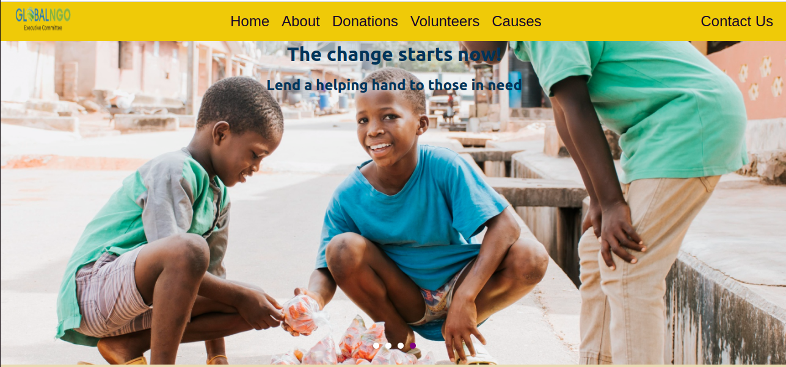
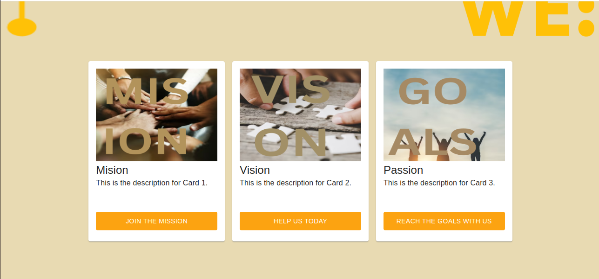
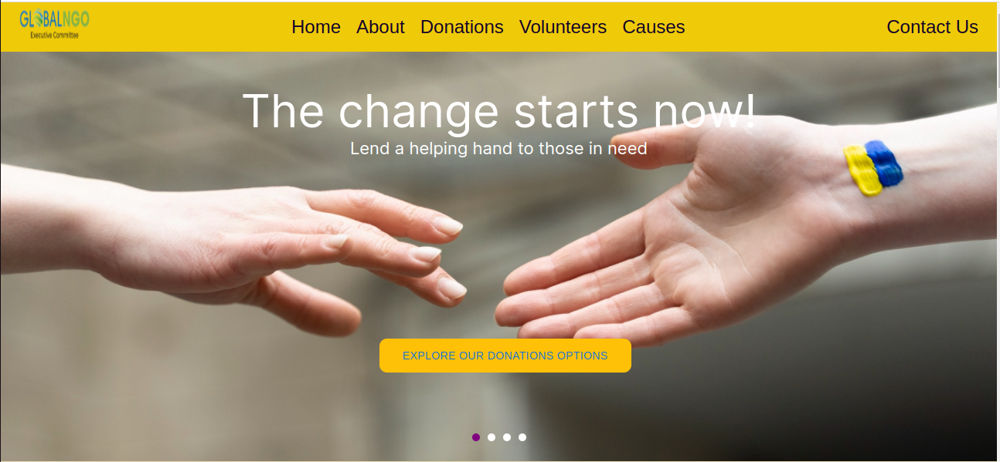
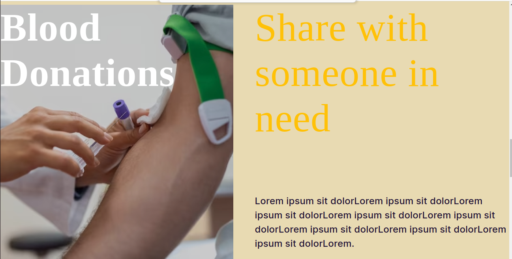
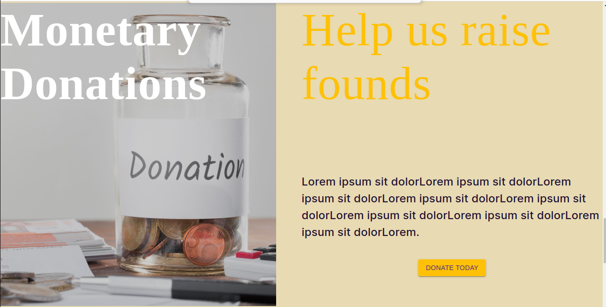

# GNEC WEB APP

- This app is a front-end side of the final project. 

Project Screenshots:
<table>
  <tr>
    <td> </td>
    <td></td>
    <td></td>
   </tr> 
   <tr>
      <td></td>
      <td></td>
      <td></td>
  </td>
   <tr>
      <td></td>
  </td>
  </tr>
</table>
 
Project Repo:
[View Here](https://github.com/Zaibonisha/gnec-web-app.git)

# [Live Demo](https://gnec-ngo.web.app/)
# Built with
 - React
 - React Router DOM
 - Tailwind css
 - Material UI
 
 
## The learning objective of this project are
 
- Create-react-app (frontend app) 
## Getting Started
 
To get a local copy up and running follow these simple steps.
 
### Prerequisites
 
- [React](https://reactjs.org/tutorial/tutorial.html#prerequisites)
 
### Setup
 
- ```git clone https://github.com/Zaibonisha/gnec-web-app.git```
 
- ```cd gnec-web-app.git```
 
### Running The App Locally
- Run `npm install & npm start`
 
# Authors

 👤 Emilija Per**
 
- [GitHub]()
- [LinkedIn](https://www.linkedin.com/in/emilija-perchinkova-2173b5126)
- [Behance](https://www.behance.net/emilijaperchinkova)
 
👤 Zaibonisha-Mohamed
 
- [GitHub](https://github.com/Zaibonisha)
- [LinkedIn](https://www.linkedin.com/in/zaibonisha-mohamed-76740b17a/)

👤 Misgana
 
- [GitHub](https://github.com/misgana96)
- [LinkedIn](https://www.linkedin.com/in/misgana-yoseph-36b42315b/)

👤 **Kingsley Ibe**
 
- [KingsleyIbe](https://github.com/KingsleyIbe)
- [Twitter](https://twitter.com/ibekingsley2)
- [LinkedIn](https://www.linkedin.com/in/kingsley-ibe/)
## 🤝 Contributing
 
Contributions, issues, and feature requests are welcome!
 
Feel free to check the [issues page](https://github.com/Zaibonisha/gnec-web-app/issues).
 
## Show your support
 
Give a ⭐️ if you like this project!
 
## Acknowledgments
 
- Hats off to [GNEC] for organizing this awesome Hackathon where this project was submitted. ✨
- The amazing code reviewers for making us improve every day 👍
 
## 📝 License
 
This project is [MIT](./LICENCE) licensed.
* ...
 
